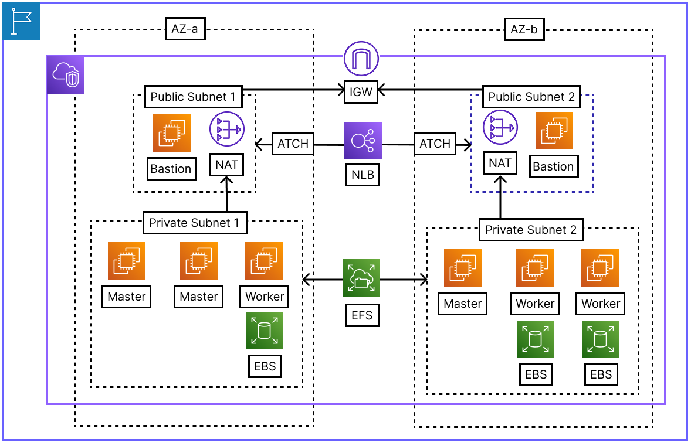

### AWS Architecture


### IAM Policy
- terraformを実行するには下記のようなIAMポリシーが必要だ
```json
{
    "Version": "2012-10-17",
    "Statement": [
        {
            "Sid": "EC2AndVPCManagement",
            "Effect": "Allow",
            "Action": [
                "ec2:*Vpc*",
                "ec2:*Subnet*",
                "ec2:*Gateway*",
                "ec2:*Route*",
                "ec2:*Address*",
                "ec2:*Instance*",
                "ec2:*SecurityGroup*",
                "ec2:*NetworkInterface*",
                "ec2:*KeyPair*",
                "ec2:*Image*",
                "ec2:*Volume*",
                "ec2:*Tag*"
            ],
            "Resource": "*"
        },
        {
            "Sid": "ELBManagement",
            "Effect": "Allow",
            "Action": [
                "elasticloadbalancing:*"
            ],
            "Resource": "*"
        },
        {
            "Sid": "EFSManagement",
            "Effect": "Allow",
            "Action": [
                "elasticfilesystem:CreateFileSystem",
                "elasticfilesystem:CreateMountTarget",
                "elasticfilesystem:DeleteFileSystem",
                "elasticfilesystem:DeleteMountTarget",
                "elasticfilesystem:DescribeFileSystems",
                "elasticfilesystem:DescribeMountTargets",
                "elasticfilesystem:ModifyFileSystem",
                "elasticfilesystem:DescribeMountTargetSecurityGroups"
            ],
            "Resource": "*"
        }
    ]
}
```
- IAM Role関連の権限ポリシー
```json
{
	"Version": "2012-10-17",
	"Statement": [
		{
			"Sid": "AllowReadSpecificRole",
			"Effect": "Allow",
			"Action": [
				"iam:GetRole",
				"iam:ListRoles",
				"iam:PassRole"
			],
			"Resource": "*"
		},
		{
			"Sid": "AllowInstanceProfileManagement",
			"Effect": "Allow",
			"Action": [
				"iam:GetInstanceProfile",
				"iam:CreateInstanceProfile",
				"iam:AddRoleToInstanceProfile",
				"iam:RemoveRoleFromInstanceProfile",
				"iam:DeleteInstanceProfile"
			],
			"Resource": "*"
		}
	]
}
```

### aws cli
- terraformではaws-cli aws confitureを通じて認証情報を読み込み
```terminal
➜  ktcloud-sptingboot-msa-market-service git:(master) brew install aws-cli
```
- CLI専用のIAM Secret Keyとap-northeast-2リージョンを入力する
```terminal
➜  ktcloud-sptingboot-msa-market-service git:(master) aws configure
```

### キーペア
- キーペアのためにシェルを稼働する
```terminal
➜  provisioning git:(master) bash ssh-key-gen.bash
```

### NLBをクラスタに登録ためのIAMロール
- EKSではなく、EC2で構築したクラスタはNLBを登録するためにノードに以下のIAM政策が必要になる
https://raw.githubusercontent.com/kubernetes-sigs/aws-load-balancer-controller/v2.7.2/docs/install/iam_policy.json
- 「ktcloud-cluster-node-role」のIAM Roleに先のIAM政策をアタッチして準備しよう

### Terrafrom
```terminal
➜  terraform git:(master) terraform plan
```
```terminal
➜  terraform git:(master) terraform apply
```
- AnsibleのPlaybookを起動するためにリモートホストのFingerprintをローカルマシンに登録する必要がある両方のbastionにssh接続して「yes」を入力しよう
```terraform
output "ap-northeast-2a-bastion-node-connect-command" {
  value = "ssh ec2-user@${aws_instance.ap-northeast-2a-bastion-node.public_ip} -i ~/.ssh/ktcloud-bastion-node-key"
}

output "ap-northeast-2b-bastion-node-connect-command" {
  value = "ssh ec2-user@${aws_instance.ap-northeast-2b-bastion-node.public_ip} -i ~/.ssh/ktcloud-bastion-node-key"
}
```

### Ansible
- inventory.iniがterraformの.tftplから作成され
- pingが届くことを確認する
```terminal
➜  ansible git:(master) ansible all -m ping -i inventory.ini
```
- K8SのクラスタセットアップPlaybookを起動する
```terminal
➜  ansible git:(master) ansible-playbook -i inventory.ini main.yaml
```

### K8S Cluster
- キーペアは同じなので、sshエージェントを登録する
```terminal
➜  ktcloud-sptingboot-msa-market-service git:(master) ✗ ssh-add ~/.ssh/ktcloud-bastion-node-key
Identity added: /Users/kanei/.ssh/ktcloud-bastion-node-key (kanei@gim-yeonghoui-MacBookPro.local)
```
- 下記のoutputの結果で一気に接続できる
```terraform
output "main-master-node-connect-command" {
  value = "ssh -A -J ec2-user@${aws_instance.ap-northeast-2b-bastion-node.public_ip} ec2-user@${aws_instance.ap-northeast-2b-master-node-01.private_ip}"
}
```
- 実際に接続して確認してみると
```terminal
[ec2-user@ip-10-0-4-212 ~]$ kubectl get nodes
NAME                                            STATUS   ROLES           AGE   VERSION
ip-10-0-2-149.ap-northeast-2.compute.internal   Ready    <none>          39m   v1.30.14
ip-10-0-2-63.ap-northeast-2.compute.internal    Ready    control-plane   40m   v1.30.14
ip-10-0-2-81.ap-northeast-2.compute.internal    Ready    control-plane   40m   v1.30.14
ip-10-0-4-196.ap-northeast-2.compute.internal   Ready    <none>          39m   v1.30.14
ip-10-0-4-212.ap-northeast-2.compute.internal   Ready    control-plane   40m   v1.30.14
ip-10-0-4-6.ap-northeast-2.compute.internal     Ready    <none>          39m   v1.30.14
```
- albを使うためのロードバランサーコントローラーも起動中であることを確認できる
```terminal
[ec2-user@ip-10-0-4-126 ~]$ kubectl get pods -n kube-system -l app.kubernetes.io/name=aws-load-balancer-controller
NAME                                            READY   STATUS    RESTARTS   AGE
aws-load-balancer-controller-5cdc56445f-9xn6t   1/1     Running   0          2m15s
aws-load-balancer-controller-5cdc56445f-gmrcr   1/1     Running   0          2m15s
```